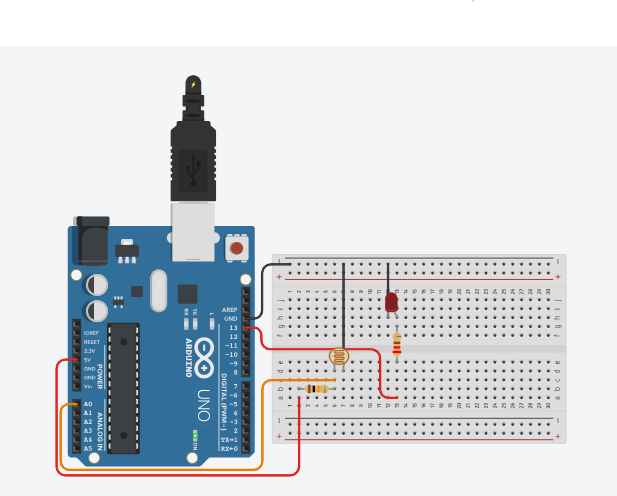

# Led sensivel a luminosidade
 Este experimento consiste fazer com que um LED controlado pela porta 13 digital seja ligado quando a luminosidade do ambiente baixe para menos de 750 unidades do fotoresistor, caso contrário o LED deve ser desligado. O fotoresistor será conectado à porta analógica 0.  

  <b><a href="https://www.tinkercad.com/things/dRY5LP0DhJi">Clique Aqui</a></b> para ver o projeto em Tinkercard.com!
  
## Lista de componentes:

- 1  Arduíno UNO R3
- 1  Um cabo de conexão USB
- 1  Placa de prototipação (Protoboard)
- 1  LED 
- 1  Resistor de 220 Ω ohms
- 1  Resistor de 10k Ω ohms
- 1  Fotoresistor (Sensor de luminosidade) LDR
- 6 Jumpers (macho-macho)

## Esquema do projeto

